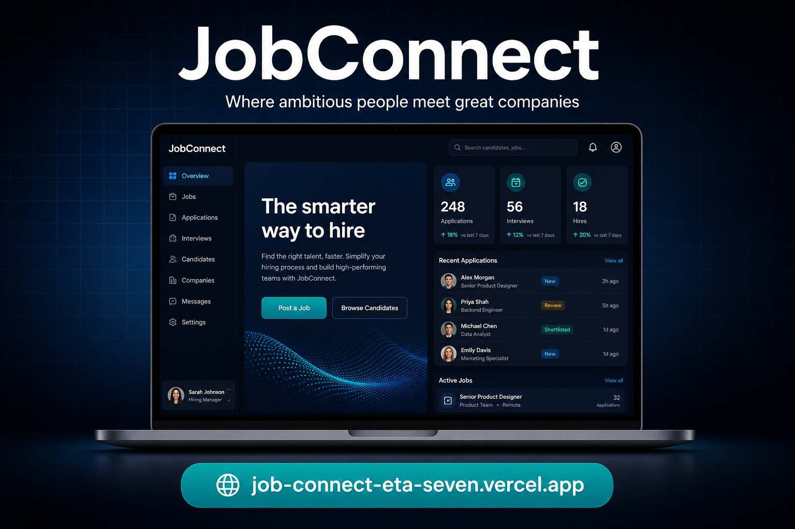

# JobConnect — Modern MERN Job Portal

**Live app:** [https://job-connect-eta-seven.vercel.app](https://job-connect-eta-seven.vercel.app)

JobConnect is a full-stack job marketplace where candidates search and apply for roles, and recruiters post jobs and manage applicants. It uses MongoDB, Express, React and Node.js, with JWT login, CV uploads, saved jobs and a recruiter pipeline.

## Highlights
- Candidate and recruiter accounts with JWT authentication
- Recruiter company profiles and job posting management
- Candidate job search, filters and saved jobs
- CV upload with Multer and PDF/DOC/DOCX validation
- Applications with cover letters and status tracking
- Recruiter applicant pipeline with status updates
- Responsive premium UI with dashboard analytics
- Protected routes and role-based authorization

## Run
1. `cd server && npm install`
2. Copy `.env.example` to `.env` and set `MONGO_URI` and `JWT_SECRET`.
3. `npm run dev`
4. In another terminal: `cd client && npm install && npm run dev`

Client: http://localhost:5173 | API: http://localhost:5000/api
